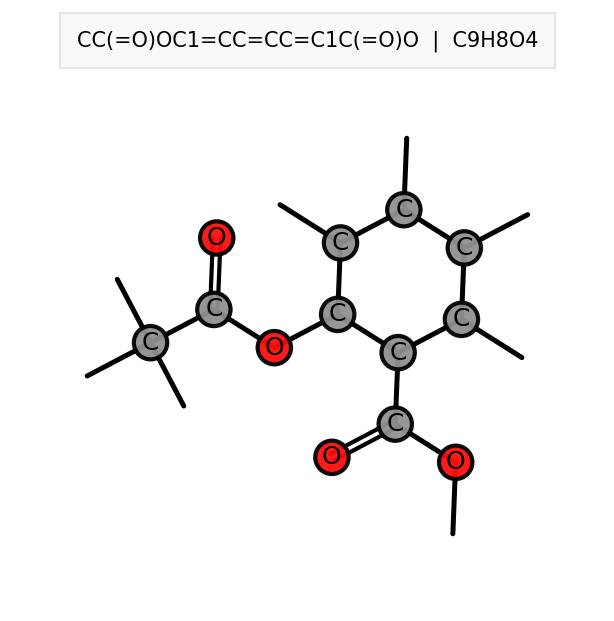

# Molecular Visualizer - Command Line Tool

A simple, powerful CLI tool to convert SMILES strings to beautiful molecule images.

## Features

✓ **Single molecule visualization** - Quick rendering of any SMILES
✓ **Batch processing** - Convert hundreds of molecules at once
✓ **Stdin support** - Pipe SMILES directly into the tool
✓ **Customizable output** - Control size, resolution, and formatting
✓ **CPK coloring** - Standard chemistry element coloring
✓ **Molecular formulas** - Auto-calculated and displayed
✓ **Bond rendering** - Single, double, triple bonds distinguished
✓ **Fast & efficient** - <1 second per molecule

## Installation

```bash
pip install rdkit matplotlib
chmod +x mol_visualizer.py
```

## Quick Start

### Single Molecule
```bash
python mol_visualizer.py "CC(=O)OC1=CC=CC=C1C(=O)O"
```
Output: `molecule_CC_O_OC1_CC_CC_C1_C_O_.png` (auto-generated)

### With Custom Output Name
```bash
python mol_visualizer.py "CC(=O)OC1=CC=CC=C1C(=O)O" --output aspirin.png
```
Output: `aspirin.png`

### Custom Size & Resolution
```bash
python mol_visualizer.py "CN1C=NC2=C1C(=O)N(C(=O)N2C)C" --size 600 400 --dpi 300
```

## Usage Modes

### Mode 1: Single SMILES String
```bash
python mol_visualizer.py "SMILES_STRING"
python mol_visualizer.py "SMILES_STRING" --output output.png
```

**Options:**
- `--output, -o` : Output PNG filename
- `--size WIDTH HEIGHT` : Image size in pixels (default: 400 400)
- `--dpi` : Resolution (default: 300 - publication quality)
- `--no-formula` : Hide molecular formula from image
- `--quiet, -q` : Suppress success messages

**Examples:**
```bash
# Caffeine
python mol_visualizer.py "CN1C=NC2=C1C(=O)N(C(=O)N2C)C" --output caffeine.png

# High resolution for printing
python mol_visualizer.py "CC(=O)OC1=CC=CC=C1C(=O)O" --dpi 600 --size 800 800

# Larger image
python mol_visualizer.py "CCO" --size 600 600 --output ethanol.png
```

### Mode 2: Batch Processing
```bash
python mol_visualizer.py --batch molecules.txt --output-dir ./images
```

**Input file format** (`molecules.txt`):
```
CC(=O)OC1=CC=CC=C1C(=O)O
CN1C=NC2=C1C(=O)N(C(=O)N2C)C
CCO
CC(C)CC(C)(C)C1=CC(=C(C=C1)C)O
```

**Options:**
- `--batch, -b` : Input file (one SMILES per line)
- `--output-dir, -d` : Directory for output images
- `--no-formula` : Don't show formulas
- `--quiet, -q` : Only print summary statistics

**Features:**
- Skips empty lines and comments (lines starting with #)
- Auto-generates filenames: `mol_0001.png`, `mol_0002.png`, etc.
- Shows success/failure for each molecule
- Prints summary: "Results: 95 success, 2 failed"

**Example:**
```bash
# Create batch file
cat > smiles.txt << EOF
# Common drugs
CC(=O)OC1=CC=CC=C1C(=O)O  # Aspirin
CN1C=NC2=C1C(=O)N(C(=O)N2C)C  # Caffeine
CCO  # Ethanol
EOF

# Process batch
python mol_visualizer.py --batch smiles.txt --output-dir ./drug_images --dpi 300
```

### Mode 3: Stdin Input
```bash
echo "CC(=O)OC1=CC=CC=C1C(=O)O" | python mol_visualizer.py --stdin
cat molecules.txt | python mol_visualizer.py --stdin --output-dir ./images
```

**Useful for piping:**
```bash
# From grep
grep -v "^#" molecules.txt | python mol_visualizer.py --stdin --output-dir ./results

# Generate on the fly
python -c "print('CC(=O)OC1=CC=CC=C1C(=O)O')" | python mol_visualizer.py --stdin
```

## Color Scheme (CPK Standard)

| Element | Color | Hex Code |
|---------|-------|----------|
| H | White | #FFFFFF |
| C | Gray | #909090 |
| N | Blue | #3050F8 |
| O | Red | #FF0D0D |
| F | Light Green | #90E050 |
| P | Orange | #FF8000 |
| S | Yellow | #FFFF30 |
| Cl | Green | #1FF01F |
| Br | Brown | #A62929 |
| I | Purple | #940094 |
| Others | Silver | #C0C0C0 |

## SMILES Examples

| Compound | SMILES |
|----------|--------|
| Aspirin | `CC(=O)OC1=CC=CC=C1C(=O)O` |
| Caffeine | `CN1C=NC2=C1C(=O)N(C(=O)N2C)C` |
| Ethanol | `CCO` |
| Benzene | `c1ccccc1` |
| Acetone | `CC(=O)C` |
| Glucose | `OCC(O)C(O)C(O)C(=O)O` |
| Celecoxib | `CC1=CC=C(C=C1)C2=CC(=NN2C3=CC=C(C=C3)S(=O)(=O)N)C(F)(F)F` |
| Ibuprofen | `CC(C)Cc1ccc(cc1)C(C)C(=O)O` |

## Advanced Usage

### Batch with Custom Settings
```bash
python mol_visualizer.py \
  --batch compounds.txt \
  --output-dir ./molecules \
  --size 600 600 \
  --dpi 600 \
  --no-formula \
  --quiet
```

### Generate with Specific Size for Different Uses
```bash
# Web (small, fast)
python mol_visualizer.py "SMILES" --size 200 200 --dpi 100 --output web_mol.png

# Print (large, high res)
python mol_visualizer.py "SMILES" --size 1000 1000 --dpi 600 --output print_mol.png

# Presentation (medium)
python mol_visualizer.py "SMILES" --size 500 500 --dpi 300 --output slide_mol.png
```

### Process All SMILES in a Directory
```bash
# Convert all .txt files with SMILES
for file in *.txt; do
  echo "Processing $file..."
  python mol_visualizer.py --batch "$file" --output-dir "./images_$(basename $file .txt)"
done
```

### Integration with Python Scripts
```python
import subprocess
import sys

# Generate image from SMILES
smiles = "CC(=O)OC1=CC=CC=C1C(=O)O"
result = subprocess.run(
    [sys.executable, "mol_visualizer.py", smiles, "-o", "molecule.png"],
    capture_output=True, text=True
)

if result.returncode == 0:
    print(f"Success: {result.stdout}")
else:
    print(f"Error: {result.stderr}")
```

## Output Details

### Image Contents
- **Molecule structure** - Atoms colored by element (CPK scheme)
- **Title** - SMILES string and molecular formula
- **Bonds** - Single, double, triple bonds shown with different widths
- **Format** - PNG with white background, no anti-aliasing artifacts

**Example output**




### File Information
```
Image Resolution: Variable (400×400 to 1000×1000 pixels)
Default DPI: 300 (publication quality)
Background: White (#FFFFFF)
Format: PNG (lossless)
Typical File Size: 20-100 KB
```

## Exit Codes

| Code | Meaning |
|------|---------|
| 0 | Success |
| 1 | Failure (invalid SMILES, file not found, etc.) |

## Performance

| Operation | Time |
|-----------|------|
| Single molecule (400×400, 300 DPI) | <1 second |
| Batch (100 molecules) | ~30-50 seconds |
| Large image (1000×1000, 600 DPI) | 2-5 seconds |

## Troubleshooting

### "Invalid SMILES"
**Problem:** SMILES string is not valid syntax
**Solution:** Check SMILES validity at [SMILES Playground](https://smiles.ncats.io/)

**Example of valid SMILES:**
```bash
python mol_visualizer.py "CC(=O)O"  # ✓ Valid (acetic acid)
python mol_visualizer.py "CC(=O)OH"  # ✓ Valid (also acetic acid)
python mol_visualizer.py "INVALID"  # ✗ Invalid
```

### "File not found"
**Problem:** Batch file path is incorrect
**Solution:** Use full path or check file exists
```bash
ls -la molecules.txt
python mol_visualizer.py --batch ./data/molecules.txt
```

### Image quality issues
**Problem:** Image looks blurry or pixelated
**Solution:** Increase DPI and/or size
```bash
# Increase resolution
python mol_visualizer.py "SMILES" --dpi 600 --size 800 800
```

### Memory issues with large batch
**Problem:** "MemoryError" on 1000+ molecules
**Solution:** Process in smaller batches
```bash
# Split file
split -l 100 large_molecules.txt batch_
# Process each
for f in batch_*; do
  python mol_visualizer.py --batch "$f" --output-dir "./out_$(basename $f)"
done
```

## Integration Examples

### With Jupyter Notebook
```python
from IPython.display import Image, display
import subprocess

smiles = "CC(=O)OC1=CC=CC=C1C(=O)O"
subprocess.run(["python", "mol_visualizer.py", smiles, "-o", "mol.png"])
display(Image("mol.png"))
```

### With Data Science Pipeline
```python
import pandas as pd
import subprocess

df = pd.read_csv("compounds.csv")

for idx, row in df.iterrows():
    smiles = row['smiles']
    name = row['name']
    subprocess.run([
        "python", "mol_visualizer.py", smiles,
        "-o", f"./molecules/{name}.png"
    ])

print(f"Generated {len(df)} molecule images")
```

### Shell Script for Automation
```bash
#!/bin/bash
# visualize_batch.sh

if [ $# -lt 2 ]; then
  echo "Usage: $0 <input_file> <output_dir>"
  exit 1
fi

INPUT="$1"
OUTPUT="$2"

mkdir -p "$OUTPUT"
python mol_visualizer.py --batch "$INPUT" --output-dir "$OUTPUT" -q
echo "✓ Generated $(ls $OUTPUT | wc -l) images in $OUTPUT"
```

## Tips & Tricks

1. **Silent processing** - Use `--quiet` flag for large batches
2. **Different sizes** - Create small web version and large print version
3. **Comments in batch files** - Use `#` to add notes
4. **Validation** - Process batch file twice with different settings
5. **Parallel processing** - Split batch file and process with `gnu-parallel`:
   ```bash
   cat molecules.txt | parallel --pipe python mol_visualizer.py --batch {} --output-dir ./images
   ```

## Support for Cheminformatics Workflows

### Input Validation
```bash
# Check SMILES validity before visualization
python -c "
from rdkit import Chem
smiles = input('Enter SMILES: ')
mol = Chem.MolFromSmiles(smiles)
print('Valid' if mol else 'Invalid')
"
```

### Extract SMILES from Other Formats
```bash
# From SDF file (requires rdkit Python)
python << EOF
from rdkit import Chem
suppl = Chem.SDMolSupplier('compounds.sdf')
for mol in suppl:
    if mol:
        print(Chem.MolToSmiles(mol))
EOF
```

## License & Citation

Simple, open-source tool for molecular visualization. Perfect for research, education, and chemical informatics workflows.

---

**Created for quick molecular structure visualization in research workflows.**

Last updated: December 2025
